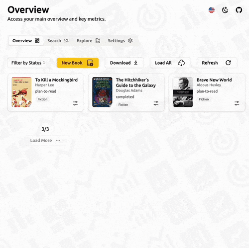
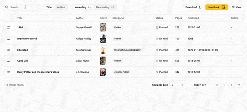
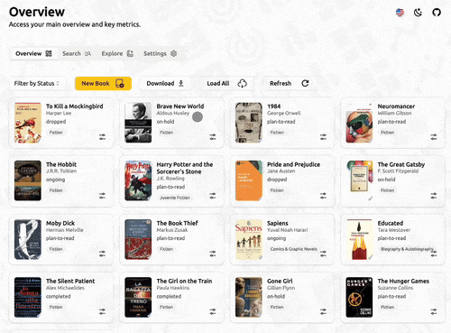
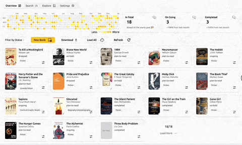
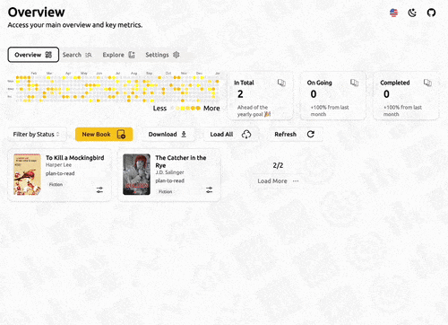
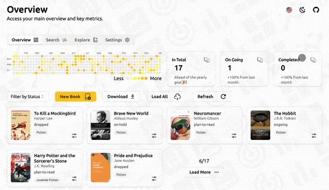
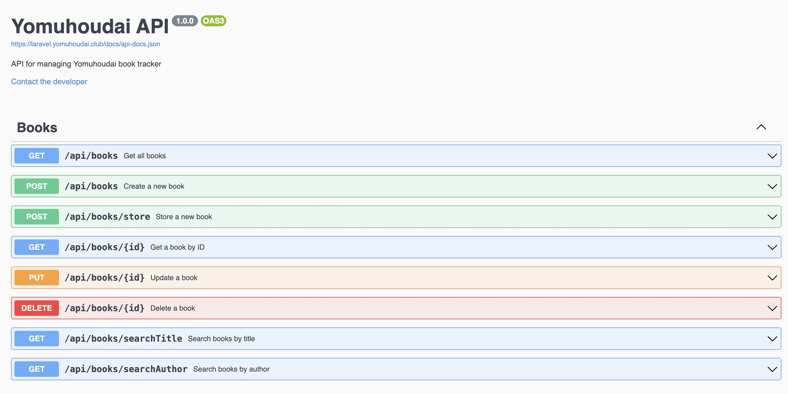

<p align="center">
  
</p>

Yomuhoudai is a full-stack web app for browsing, managing, and performing CRUD operations on a book collection. It uses Laravel for the backend API, Nuxt for the frontend, and supports both local development (via Docker) and production deployment (via Coolify on a Hetzner VPS).
<br />

Live demo: <https://app.yomuhoudai.club/dashboard> <br>
From landing page: <https://library.yomuhoudai.club>

## Table of Contents

- [Requirements](#requirements)
- [Setup](#setup)
- [Quick visual tour](#quick-visual-tour-of-what-yomuhoudai-can-do)
- [Running Unit Tests](#running-unit-tests)
- [Environment Configuration](#environment-configuration)
- [Frontend Development Setup](#frontend-development-setup)
  - [Option 1: Using Docker Compose](#option-1-using-docker-compose)
  - [Option 2: Local Node Environment](#option-2-local-node-environment)
- [Deployment and CI/CD Overview](#deployment-and-cicd-overview)
  - [GitHub Workflow for Staging Deployment](#github-workflow-for-staging-deployment)
- [API Documentation](#api-documentation)
- [Frontend Directory Structure](#frontend-directory-structure)
- [Stores](#stores)
  - [1-useLibrary](#1-uselibrary)
  - [2-useStateManager](#2-usestatemanager)
  - [3-useToastManagerStore](#3-usetoastmanagerstore)

## Requirements

- [Docker](https://docs.docker.com/install)
- [Docker Compose](https://docs.docker.com/compose/install)

## Setup

1. Clone the repository.

```bash
git clone https://github.com/kaandesu/yomuhoudai.git
```

2. Start the containers by running:

```bash
docker-compose up -d
```

3. Install the Composer dependencies inside the Laravel container:

```bash
docker-compose exec laravel composer install
```

4. Run the database migrations:

```bash
docker-compose exec laravel php artisan migrate --force
```

5. (Optional) Run the database seeder to preload some sample books:

```bash
 docker-compose exec laravel php artisan db:seed --force
```

Persistent database:

If you want to ensure that your database data persists even if the MySQL container is removed, create a file named `docker-compose.override.yml` in the project root with the following contents:

```yaml
version: "3.7"

services:
  mysql:
    volumes:
      - mysql:/var/lib/mysql

volumes:
  mysql:
```

Then restart the containers with:

```bash
docker-compose stop \
  && docker-compose rm -f mysql \
  && docker-compose up -d
```

---

## Quick visual tour of what Yomuhoudai can do

<table>
  <tr>
    <td style="width: 50%; vertical-align: top;">
      <h3>Card Operations</h3>
      <p>Update reading progress, change status, and manage books with quick actions.</p>
      
    </td>
    <td style="width: 50%; vertical-align: top;">
      <h3>Explore Page</h3>
      <p>Discover recommended books and add them to your library with one click.</p>
      
    </td>
  </tr>
  <tr>
    <td style="width: 50%; vertical-align: top;">
      <h3>Search Page</h3>
      <p>Search by title or author, sort results, paginate, and download them as needed.</p>
      
    </td>
    <td style="width: 50%; vertical-align: top;">
      <h3>Pagination & Filtering</h3>
      <p>Paginate and filter books by status on the overview page.</p>
      
    </td>
  </tr>
  <tr>
    <td style="width: 50%; vertical-align: top;">
      <h3>Add New Book</h3>
      <p>Seamlessly create new book entries with a simple form UI.</p>
      
    </td>
    <td style="width: 50%; vertical-align: top;">
      <h3>Responsive Design</h3>
      <p>Fully responsive interface optimized for mobile, tablet, and desktop.</p>
      
    </td>
  </tr>
  <tr>
    <td style="width: 50%; vertical-align: top;">
      <h3>Feature Preview</h3>
      <p>Enable or disable early-access features from the settings panel.</p>
      
    </td>
    <td style="width: 50%;">
      <h3>Dark Mode</h3>
      <p>Syncs with system settings or toggle manually for comfort.</p>
      
    </td>
  </tr>
</table>

### Environment Configuration

The `docker-compose.yml` file includes pre-configured environment variables under the `laravel` service:

```yaml
APP_DEBUG: "false" # Set to "true" for development mode
APP_ENV: production # Set to "local" for development environment
```

You can modify these values depending on your setup. For local development, it’s recommended to use:

```yaml
APP_DEBUG: "true"
APP_ENV: local
```

---

### Running Unit Tests

To run the feature tests for the BookController, use the following command inside the Docker environment:

```bash
docker-compose exec -e APP_ENV=testing laravel \
  ./vendor/bin/phpunit \
  tests/Feature/BookControllerTest.php
```

This will execute the test suite located at tests/Feature/BookControllerTest.php with the application in the testing environment

#### BookController - Tested Scenarios

<details>
  <summary>Click to expand the list of tested scenarios</summary>

- test_can_store_book_with_full_payload
- test_can_create_book_with_japanese_characters
- test_can_create_book_with_emojis
- test_cannot_create_book_with_extremely_long_title
- test_can_create_book_with_special_symbols
- test_rejects_html_or_js_injection
- test_rejects_negative_page_count
- test_rejects_negative_page_count_update
- test_can_store_book_with_zero_width_space
- test_can_store_book_with_nullables
- test_store_duplicate_book_returns_409
- test_can_update_book
- test_update_nonexistent_book_returns_500
- test_can_show_book
- test_show_nonexistent_book_returns_404
- test_search_title_returns_results
- test_search_author_returns_results
- test_store_requires_title_and_author
- test_update_requires_title_and_author_if_present
- test_can_delete_book
- test_delete_nonexistent_book_returns_404
- test_index_returns_books_list
- test_export_returns_csv_data
- test_export_returns_xml_data
- test_search_title_pagination_and_sorting
- test_search_author_pagination_and_sorting

</details>

## Frontend Development Setup

You have two options to run the frontend during development:

### Option 1: Using Docker Compose

Run the full stack including the frontend container with:

```bash
docker-compose up -d frontend
```

This uses the Dockerfile under `frontend/` which builds and serves the app via nginx on port `3000`.

---

### Option 2: Local Node Environment

1. Enter frontend folder

```bash
cd frontend
```

2. Install dependencies:

```bash
pnpm install
```

3. Start the dev server:

```bash
pnpm dev
```

By default, the frontend connects to the deployed backend server.

To connect to your local backend instead, run:

```bash
NUXT_PUBLIC_DEV_MODE=true pnpm dev
```

This sets the frontend to send API requests to your local Laravel backend. You can change the default behaviour
through [runtimeConfig](https://nuxt.com/docs/guide/going-further/runtime-config) located in nuxt.config.ts.

<br/>
<small>Note: In order have a clear testing setup, it is advised to clear the local storage under the "Application" tab in the developer console every once in a while.</small>

---

## Deployment and CI/CD Overview

The project is deployed on a VPS rented from Hetzner and managed via Coolify, which provides easy app deployment and management.

- The backend Laravel API is hosted at:  
  <https://laravel.yomuhoudai.club/>
  <https://api.yomuhoudai.club/>

- The backend staging deployment is hosted at:  
  <https://api-staging.yomuhoudai.club/>

- The frontend app is deployed and accessible at:  
  <https://app.yomuhoudai.club/>  
  <https://library.yomuhoudai.club/>

- Coolify management dashboard is available at:  
  <https://cloud.yomuhoudai.club/>

- Caddy is configured as a reverse proxy to handle routing and HTTPS certificates.

---

### GitHub Workflow for Staging Deployment

There is a GitHub Actions workflow that automatically deploys the frontend to a staging environment on every push to the `staging` branch.

- Staging site URL:  
  <https://staging.yomuhoudai.club/>

This ensures continuous integration and deployment for testing and preview before production releases.

---

## API Documentation

Interactive API documentation is available via Swagger UI:

🔗 [https://laravel.yomuhoudai.club/api/documentation](https://laravel.yomuhoudai.club/api/documentation)

This includes all available endpoints, request/response formats.

<p align="left">
  
</p>

To generate new docs after making changes you can use:

```bash
php artisan l5-swagger:generate
```

---

## Frontend Directory Structure

```python
frontend/
├── app.vue                 # frontend entry point
├── assets/css/             # Tailwind and global CSS
├── components/             # UI components for modular usage
│   ├── DataTable/          # Book list display components
│   └── Landing/            # Hero, Features, etc. for home page
├── config/                 # Configs for various sections/pages
│   ├── misc/               # Miscellaneous configs (i18n, Nuxt image, Tailwind, viewport)
│   │   pages/              # Page configs for app navigation and metadata
│   └── landing/            # Landing page configs (benefits, features, hero, sponsors, team)
├── i18n/                   # Locale files (en, jp, tr, etc.)
├── layouts/                # Default layouts like main and with-tabs
├── lib/                    # Utility functions (e.g., date or string utils)
├── pages/                  # Nuxt file-based routing
│   ├── dashboard/          # /dashboard routes
│   │   ├── index.vue       # Overview page
│   │   ├── explore.vue     # Book recommendations
│   │   ├── search.vue      # Book search & management
│   │   └── settings.vue    # Settings page
│   └── index.vue           # landing page entry
├── public/                 # Static assets like images, favicon
├── server/                 # Server runtime configs
stores/
├── library.ts              # Pinia store managing book list and CRUD via API
├── stateManager.ts         # Pinia store managing app navigation, page state, and API keys
├── toastManagerStore.ts    # Pinia store for toast notification creation and management
types/                      # common ts types
utils/                      # General-purpose reusable utilities
├── create-toast.ts         #  Helper function that uses the toastManagerStore
├── find-page-by-id.ts      # Finds and returns a page object by its unique ID.
├── clean-book-payload.ts   # Formats the book payload compliant to the backend schema
nuxt.config.ts              # Nuxt setup (modules, i18n, tailwind, etc.)
tailwind.config.js          # Tailwind v3 setup
```

---

## Stores

### 1-useLibrary

This Pinia store manages a collection of books with CRUD operations, search, pagination, export, and user feedback via toast notifications.

#### State

- `books: Book[]` – List of all books in the library.
- `loading: boolean` – Indicates if an API request is in progress.
- `suggestions: Book[]` – List of suggested books (Editor's Choice or AI-based).
- `searchResults: Book[]` – Books returned by a search.
- `searchQuery: string` – Query input for search.
- `searchData: SearchData` – Metadata for search pagination.
- `overviewPaginationData: OverviewPaginationData` – Metadata for general pagination.

#### Functions

- **getBooks({ onSuccess?, onError? })**  
  Fetches all books from `/api/v1/books`. Updates `books`. Shows a toast on success/failure.

- **getBooksPaginated({ page?, onSuccess?, onError? })**  
  Loads books page by page using `/api/v1/books/search/title`. Updates `books` and `overviewPaginationData`.

- **createBook({ book, onSuccess?, onError? })**  
  Creates a book via `POST /api/v1/books`. Adds it to `books` and updates pagination total. Triggers success/error toast.

- **updateBook({ book, onSuccess?, onError? })**  
  Updates a book via `PUT /api/v1/books/{id}`. Merges the updated info in `books`. Triggers success/error toast.

- **deleteBook({ id, onSuccess?, onError? })**  
  Deletes a book using `DELETE /api/v1/books/{id}`. Removes it from both `books` and `searchResults`. Updates pagination total. Triggers a toast.

- **downloadBooks({ type, format, onSuccess?, onError? })**  
  Exports books as file using `/api/v1/books/export`. Automatically downloads the result as `.csv` or `.xml`. Triggers a toast.

- **searchBooksBy(field)({ page?, onSuccess?, onError? })**  
  Searches books by the given `field` (`"title"` or `"author"`) using `GET /api/v1/books/search/{field}?q=...`, with support for pagination and sorting; stores results in `searchResults`.

#### Notes

- <small>All API calls are made using `$fetch.create` with centralized `onResponse` and `onResponseError` handlers. As useFetch can only be used in script setup context.</small>
- <small>Functions support optional `onSuccess` and `onError` callbacks.</small>
- <small>`loading` flag is toggled for all network operations to show spinners or disable UI components.</small>
- <small>Pagination info for general and search views are stored separately.</small>

---

### 2-useStateManager

This Pinia store manages global UI state, such as navigation toggle, API keys, loading indicators, and active page metadata. It also provides helper functions for dynamic page navigation and feature toggling.

#### State

- `navState: { open: boolean; collapsed: boolean }` – Tracks sidebar menu's open/collapsed status.
- `apikeys: { gpt: string }` – Stores API keys such as GPT key.
- `loadingPage: boolean` – Indicates when a route navigation is in progress.
- `currentPageInfo: Page` – Metadata about the current active page.
- `featurePreview: { aiSuggestions: boolean; heatmap: boolean }` – Flags for enabling preview features.

<small>Note: `navState` and `apikeys` are persisted in `localStorage` for consistent UI state across sessions.</small>

#### Functions

- **findPage(id: string): Page \| false**  
  Looks up a page by its UID in the `pages` object. Returns the `Page` if found, else `false`.

- **updateActivePage(id: string): Page**  
  Updates `currentPageInfo` to the matching page. If no match is found, sets a fallback `{ uid: id }`. Returns the new page info.

- **navigatePage(page: Page): Promise<void>**  
  Starts loading animation, sets the active page, then uses `navigateTo(page.href)` to navigate. Loading stops once complete.

- **navigatePageById(id: string): Promise<void>**  
  Shorthand for navigating using a page's UID. Internally resolves the page and calls `navigateTo`.

#### Notes

- <small>Page metadata comes from a central `pages` object (external).</small>
- <small>`featurePreview` allows toggling experimental features like AI Suggestions or Heatmaps.</small>
- <small>Used by layout or navigation components to control transitions and active page state across the app.</small>

---

### 3-useToastManagerStore

This Pinia store provides a centralized way to create various types of toast notifications using `vue-sonner`. It supports multiple toast types with customizable options.

#### Functions

- **create({ message: string, toastOps?: ToastT, type?: ToastTypes }): Function**  
  Returns a function that triggers a toast notification with the specified message, options, and type.
  - `message`: Text to display in the toast.
  - `toastOps`: Optional settings like icon, duration, position, actions, and styling.
  - `type`: Toast category such as `"success"`, `"info"`, `"warning"`, `"error"`, `"loading"`, or `"default"`.

---
